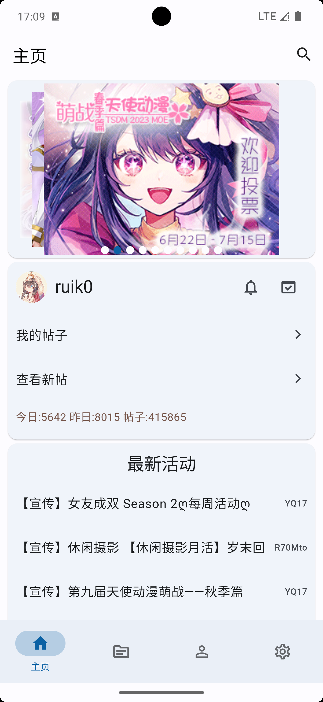
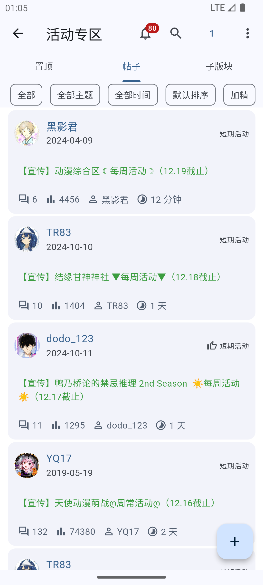
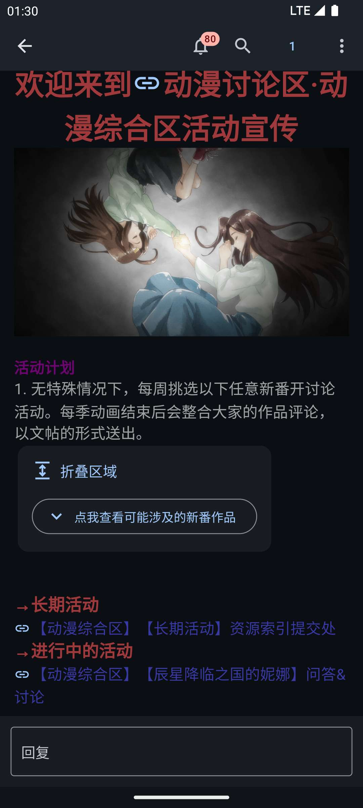
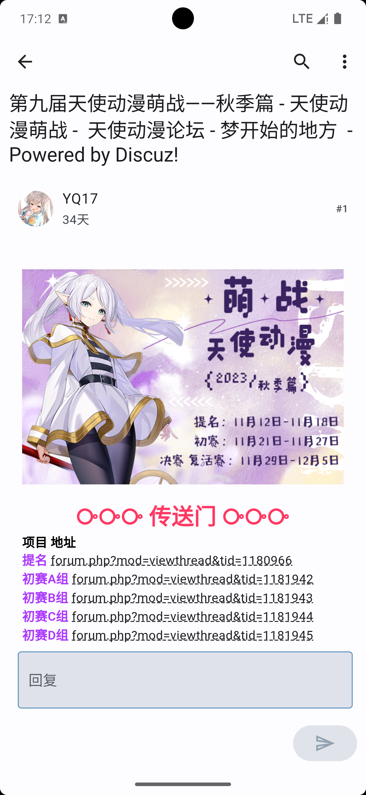
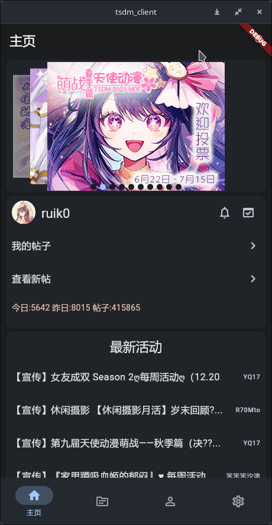
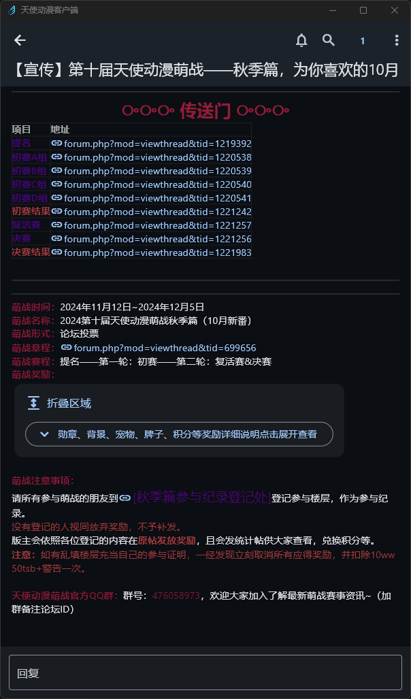

<h1 align="center">
    <a href="https://github.com/realth000/tsdm_client/">
        
    </a>
    <br>
    tsdm_client
</h1>

<p align="center">
天使动漫论坛官方跨平台客户端
</p>

<p align="center">
  <a href="https://github.com/realth000/tsdm_client/actions"></a>
  <a href="https://github.com/realth000/tsdm_client/releases"></a>
  <a href="https://github.com/realth000/tsdm_client/releases"></a>
  <a href="https://github.com/realth000/tsdm_client/releases"></a>
  <a href="https://flutter.dev/"></a>
  <a href="https://dart.dev/"></a>
</p>

> [!TIP]
>
> 受测试条件限制，标注为已实现的功能也可能有缺陷，欢迎提issue或PR。

## 截图

<div align="center">
  <table>
    <tr>
      <td align="center">
        
      </td>
      <td align="center">
        
      </td>
    </tr>
    <tr>
      <td align="center">
        
      </td>
      <td align="center">
        
      </td>
    </tr>
    <tr>
      <td align="center">
        
      </td>
      <td align="center">
        
      </td>
    </tr>
  </table>
</div>

## 下载

<div align="left">
  <table>
    <thead align="left">
     <tr>
       <th>系统</th>
       <th>版本</th>
     </tr>
    </thead>
  <tbody>
    <tr>
      <td>Android</td>
      <td>
        <a href="https://github.com/realth000/tsdm_client/releases/latest/download/tsdm_client-arm64_v8a.apk"></a><br>
        <a href="https://github.com/realth000/tsdm_client/releases/latest/download/tsdm_client-armeabi_v7a.apk"></a><br>
        <a href="https://f-droid.org/packages/kzs.th000.tsdm_client/"></a><br>
      </td>
    </tr>
    <tr>
      <td>iOS</td>
      <td>
        <a href="https://github.com/realth000/tsdm_client/releases/latest/download/tsdm_client.ipa"></a><br>
      </td>
    </tr>
    <tr>
      <td>Linux</td>
      <td>
        <a href="https://github.com/realth000/tsdm_client/releases/latest/download/tsdm_client-linux.tar.gz"></a><br>
      </td>
    </tr>
    <tr>
      <td>macOS</td>
      <td>
        <a href="https://github.com/realth000/tsdm_client/releases/latest/download/tsdm_client-universal.dmg"></a><br>
      </td>
    </tr>
    <tr>
      <td>Windows</td>
      <td>
        <a href="https://github.com/realth000/tsdm_client/releases/latest/download/tsdm_client-windows.zip"></a><br>
      </td>
    </tr>
  </tbody>
  </table>
</div>

> [!TIP]
>
> * iOS和macOS平台的产物没有测试环境，未经过测试，欢迎提issue和PR。
> * iOS和macOS平台产物并未签名，ipa签名请自行寻找方法。

## 功能

* [x] 看贴
  * [x] 回复
  * [x] 基本信息（用户名、头像）
  * [x] 其他信息（用户组、昵称、头衔等）
  * [x] 链接跳转
  * [x] 电梯直达
  * [x] 倒序浏览
  * [x] 筛选和排序帖子
  * [x] 只看指定作者
  * [x] 展开/折叠
  * [x] 引用
  * [x] 提示有投票区域（不实现投票功能）
  * [x] 查看点评
  * [x] 评分/查看评分
  * [x] 代码块
  * [x] 我的帖子
  * [x] 查看新帖
  * [x] 帖子类型（加精，置顶，已关闭等）
  * [x] 置顶帖
  * [x] 领取红包
  * [x] 悬赏/悬赏答案
  * [x] 积分信息
  * [x] 签到信息
  * [x] 勋章
  * [x] 第二牌子
  * [x] 签名档
  * [x] 查看图片
* [x] 回帖
  * [x] 回复文字
  * [x] 回复其他楼层
  * [x] 编辑回复
  * [x] 编辑帖子（一楼）
  * [x] [富文本模式](#富文本支持)
* [x] 编辑帖子
  * [x] 修改纯文本内容
  * [x] 设置分类和标题
  * [x] 设置附加选项
  * [x] 设置阅读权限
  * [x] 设置售价
  * [x] [富文本模式](#富文本支持)
* [x] 发帖
  * [x] 纯文本内容
  * [x] 保存为草稿
  * [x] 编辑草稿
  * [ ] 本地自动保存
  * [x] 设置分类和标题
  * [x] 设置附加选项
  * [x] 设置阅读权限
  * [x] 设置售价
  * [x] [富文本模式](#富文本支持)
* [x] 登录
  * [x] 用户名登录
  * [x] UID或邮箱登录
  * [x] 带安全问题登录
  * [x] 登录一次后cookie自动登录
  * [x] 退出登录
  * [x] 多账户登录
* [x] 搜索
  * [x] 按作者id和论坛id搜索
* [x] 积分
  * [x] 积分统计和历史记录
  * [x] 查询积分记录
* [ ] 购买
  * [x] 购买帖子
  * [x] 回复后可见
  * [ ] 购买记录
* [x] 签到
  * [x] 手动签到
  * [x] 自动签到（为所有用户）
* [x] 深色模式
  * [x] 手动设置
  * [x] 跟随系统
  * [x] 自动调整帖子内的颜色
* [x] 主题
  * [x] 更换主题色
  * [x] 动态颜色
* [ ] 用户信息
  * [x] 查看用户信息
  * [x] 积分信息
  * [x] 签名档
  * [x] 修改头像
  * [ ] 修改个人资料
  * [x] 切换用户组
* [x] 通知
  * [x] 查看提醒
  * [x] 回复提醒
  * [x] 跳转到提醒的帖子
  * [x] 查看私信/系统消息
  * [x] 查看私信对话历史
  * [x] 回复私信
  * [x] 发送私信
  * [x] 发送富文本私信
  * [x] 自动拉取通知
  * [x] 自动拉取到新通知时发送系统通知（安卓）
* [ ] 好友
  * [ ] 加好友
  * [ ] 查看好友
  * [ ] 分组
  * [ ] 删除
* [ ] 收藏
  * [ ] 收藏帖子或分区
  * [ ] RSS订阅
* [x] 多用户

### 不实现的功能

**考虑到安全性和测试条件，以下功能不会实现**

* 账号安全：更改密码、更换邮箱和设置安全问题。
* 版主权限：帖子操作、用户操作和版区操作等。

## 富文本支持

### 概述

目前正在添加bbcode的富文本支持，最终会在发表帖子/回复/消息等场景内支持所见即所得的bbcode书写体验。

BBCode编辑器主要功能存放在单独的仓库[flutter_bbcode_editor](https://github.com/realth000/flutter_bbcode_editor)中。

### 编写

编写新内容时，以所见即所得的形式输入和编辑以下样式中支持的部分。

* [x] 文本样式
  * [x] 字号（固定大小1-7）`[font]`
  * [x] 字体颜色 `[color]`
  * [x] 背景颜色 `[backcolor]`
  * [x] 粗体 `[b]`
  * [x] 斜体 `[i]`
  * [x] 下划线 `[u]`
  * [x] 删除线 `[s]`
  * ~~字体 `[font]`~~（不实现）
* [x] 表情 `{:$GROUP_$ID:}`
* [x] 网页链接 `[url]`
  * [x] 添加
  * [x] 修改
* [x] 外链图片 `[img]`
  * [x] 添加
  * [x] 设置大小
  * [x] 修改
  * [x] 自动填充图片大小
  * [x] 根据比例自动设置长度或宽度
* [x] 折叠卡片 `[spoiler]` （Android尚不支持）
* [x] 隐藏内容 `[hide]`（Android尚不支持）
  * [x] 根据积分隐藏 `[hide=$POINTS]`
  * [x] 需要回复 `[hide]`
* [x] 代码块 `[code]`
* [x] 引用文字 `[quote]`
* [x] 分隔线 `[hr]`
* [x] 提醒用户 `[@]`
  * [x] 根据用户名搜索
  * [x] 随机推荐好友
* [x] 无序列表 `[list]`
* [x] 有序列表 `[list=1]`
* [ ] 表格 `[table]`
* [x] 上标 `[sup]`
* [x] 对齐
  * [x] 居左 `[align=left]`
  * [x] 居中 `[align=center]`
  * [x] 居右 `[align=right]`

### 解析

编辑已发布的内容时，可将以下样式中支持的部分解析为所见即所得的内容，而不支持的样式将以纯文本的形式呈现。

* [x] 文本样式
  * [x] 字号（固定大小1-7）`[font]`
  * [x] 字体颜色 `[color]`
  * [x] 背景颜色 `[backcolor]`
  * [x] 粗体 `[b]`
  * [x] 斜体 `[i]`
  * [x] 下划线 `[u]`
  * [x] 删除线 `[s]`
  * ~~字体 `[font]`~~（不实现）
* [ ] 表情 `{:$GROUP_$ID:}`
* [x] 网页链接 `[url]`
* [x] 外链图片 `[img]`
* [ ] 折叠卡片 `[spoiler]`
* [ ] 隐藏内容 `[hide]`
* [x] 代码块 `[code]`
* [x] 引用文字 `[quote]`
* [x] 分隔线 `[hr]`
* [x] 提醒用户 `[@]`
* [ ] 无序列表 `[list]`
* [ ] 有序列表 `[list=1]`
* [ ] 表格 `[table]`
* [x] 上标 `[sup]`
* [x] 对齐
  * [x] 居左 `[align=left]`
  * [x] 居中 `[align=center]`
  * [x] 居右 `[align=right]`

## 已知问题

~~在修了在修了~~

* 暂不支持论坛的`璀璨星河`主题，请不要在设置中使用该主题。
* 长时间使用至cookie过期时一些功能可能无法使用，例如签到，此时请重新登录。

## 开发

### 编译

``` shell
# 1. All
git clone --recursive https://github.com/realth000/tsdm_client
cd tsdm_client
dart ./Makefile.dart

# 2. Android
flutter build apk

# 2. iOS
flutter build ios --no-codesign

# 2. Linux
flutter build linux

# 2. macOS
flutter build macos

# 2. Windows
flutter build windows
```

### 更新数据库schema

```bash
# One step
dart ./Makefile.dart

# Or manually
# Export schema
dart run drift_dev schema dump lib/shared/providers/storage_provider/models/database/database.dart lib/shared/providers/storage_provider/models/database/schema/migration/
# Generate migration
dart run drift_dev schema steps lib/shared/providers/storage_provider/models/database/schema/migration/ lib/shared/providers/storage_provider/models/database/schema/schema_versions.dart
# Update schema for test
dart run drift_dev schema generate lib/shared/providers/storage_provider/models/database/schema/migration/ test/data/generated_migrations/
```

## 隐私

本程序不会收集或上传任何系统或设备或用户信息，访问主站时使用的凭据均只保存在设备本地。

* 保存用户信息，包括用户名、UID和cookie供登录和访问时使用。

## 许可

本程序在[MIT License](./LICENSE)下分发。
